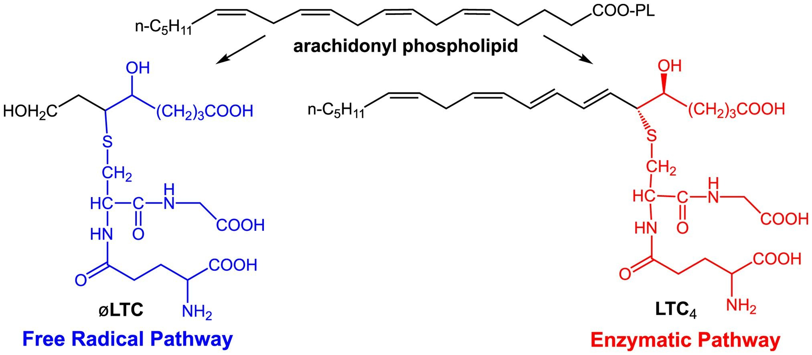

## Activation and Potentiation of Human Mast Cells by Cysteinyl Leukotriene-Like Metabolites

Mast cells are central to allergic inflammation and asthma, typically activated through IgE-mediated pathways. My research explores a newly discovered class of arachidonate derivatives—pseudo-leukotrienes (øLTs), which may activate mast cells independently of IgE. Using LUVA mast cells, we observed that øLTs trigger phosphorylation of key signaling proteins (ERK, Akt, and NFκB) in a time-dependent manner, similar to classical cysteinyl leukotrienes (CysLT4). Ongoing work focuses on measuring mast cell degranulation, histamine release, and inflammatory cytokine production to determine whether øLTs could represent a novel therapeutic target for asthma, especially in patients who do not respond to current treatments.

